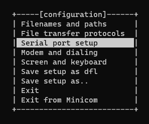
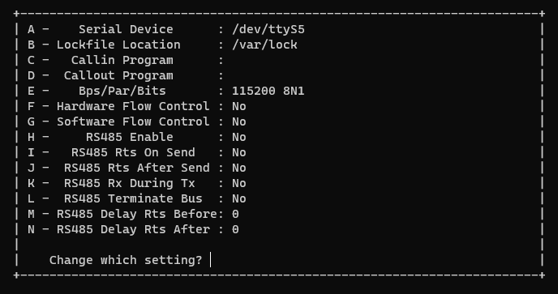

# 1 - Bananapi setup

## Introduction

On my last birthday, some Simple and Uneducated QA gave me
BananaPi M2Berry (probably to gave us another topic for our near-daily discussions).

But the real reason is that I'm becoming more and more interested in going with embedded stuff (and to be honest I didn't pay much attention on these classed during University time - laziness and other things that will not mention here).

Nevertheless past is past, so let's get started.

BananaPi is a brand of open source mini computers that you can play with and do 
anything you like (similar to famous RaspberryPi).

Here I'm going to describe what I did to start up BananaPi based on the official getting started guide.

First note worth to mention are the abbreviations (got me a little time to used to them by some reason):
* BPI = BananaPI
* M2B = M2Berry

Any work here was done on Windows 10 on Debian with WSL1.

## Setup OS

The device comes without any operating system, so as a first step is to get one and put it on the BPI. Here mostly the [getting started](https://wiki.banana-pi.org/Getting_Started_with_M2_Ultra_%26_Berry) meant for my computer was a really good start.

### OS image

For my computer I took the Armbian image since it was updated in 2023. Here are the ways to get the image:
* From the [wiki](https://wiki.banana-pi.org/Banana_Pi_BPI-M2_Berry#Armbian) of your computer - link is on the Google drive and there is a lot of images to pick.
* From the Armbian [website](https://www.armbian.com/bananapi-m2u/) meant for my computer.
* By building [your very own](https://docs.armbian.com/Developer-Guide_Build-Preparation/) Armbian.

I booted M2B with all these ways (building from source was a real fun and was easier than I anticipated - 100% recommendation).

In the end I stayed with the release from the Armbian website (my custom build was 4GB and the site realease was much lighter and was too lazy to rebuild it - maybe in future).

### Flashing

Pick your SD card and go to the official [getting started](https://wiki.banana-pi.org/Getting_Started_with_M2_Ultra_%26_Berry).

### Communication (minicom)

When the memory card is flashed then it would be good to see something from the OS booting. You can do either:
* Connect computer with some monitor/TV over HDMI, add keyboard and mouse (as long as you have some graphical layer in your OS).
* Connect with wire (since the network was not available for my first boot of Armbian) and this way I'm going to describe.

#### How I did it

My BPI comes with a debugging UART pins: . I connected my UART->USB cable to my PC by USB and UART to M2B (keep in mind: ground comes to the ground RX to TX and TX to RX).

Then I had to install [minicom](https://wiki.emacinc.com/wiki/Getting_Started_With_Minicom).

```
sudo apt install minicom
```

For WSL1 I had to configure minicom since the default setup was not working. To open setup menu:
```
sudo minicom -s
```



Opened serial port setup:


And set:
* Serial device from `/dev/modem` to `/dev/ttyS5` - my UART/USB was connected to the COM5 port for Windows. For WSL1 COM ports from Windows are mapped for matching `dev/ttySN` port.
* Change hardware flow control to `No` since RTS and CTS pins are not connected.

With that I could power-on BPI and start booting.

## First boot

Booting process for armbian was super user friendly, I was asked to do the following:
* Set the password for root (sometimes the pre-built images for BPI comes with a setup root user called `root` with password `bananapi`).
* Set my user account.
* Set locale for the system.
* Connect with network (since M2B comes with WiFi I simply connected to my home network without any additional effort).

After the boot was done I logged to my account on BPI and was able to disconnect the UART and use the SSH connection.

## SSH network connection

Knowing the IP address of BPI I'm able to connect with:
```
ssh account@ip_address
```
And work on BPI without cable and additional screens (who needs display when you can get everything in the terminal?).

## Conclusion

Here I just described my first steps with BananaPI. Any feedback/comment is mostly appreciated.

[Back to Home](../../README.md)
