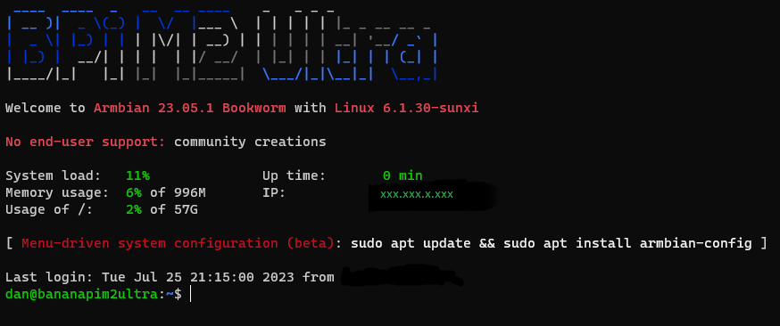

# 2 - Basic GPIO

## Introduction

So when the board is up and running and greets with such beautiful screen:

Then there is a urge to do something. What it can be? GPIO - let's check if it's working.

[Back to Home](../README.md)
